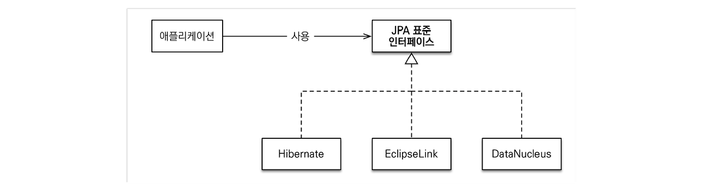

# Spring Data JPA

## JPA란??

JPA란 **ORM (Object Relational Mapping) 객체 관계 매핑 기술의 표준**으로 인터페이스의 모음이다.

실제로 동작하는 것이 아니기 때문에 구현체가 필요한데, JPA 표준을 구현한 구현체는 아래와 같이 Hibernate, EclipseLink, DataNucleus 가 있다. 

- **ORM :** 객체와 관계형 데이터 베이스를 매핑해 주는 기술이다.

> JPA의 동작 과정

JPA는 Java 애플리케이션과 JDBC 사이에서 동작하는데 Java 애플리케이션에서 JPA를 사용하면 내부에서 JDBC API를 사용해 SQL을 DB에 전달하고 결과를 반환 받는다.

### 객체 매핑

JPA에서 엔티티란, DB 테이블에 대응하는 하나의 클래스이다.

@Entity 어노테이션이 붙은 클래스를 JPA가 각 필드의 어노테이션을 보고 DB테이블과 매핑해 관리 해주게 된다.

> 매핑 어노테이션

- @Entity : 테이블과의 매핑

@Entity가 붙은 클래스는 JPA가 관리하며 엔티티 이름을 지정하지 않으면 기본값인 클래스 이름을 사용한다.

- @Id : 기본 키 매핑

- @GeneratedValue : 기본 키 생성 전략

GenerationType.IDENTITY 옵션은 기본 키 생성을 DB에 위임한다.

- @Column : 객체 필드를 테이블 컬럼에 매핑

nullable 옵션 : null 값의 허용 여부 설정 (기본값 : true)

unique 옵션 : 유니크 제약조건

lengh 옵션 : 문자 길이 제약조건, String 타입에만 사용

> @Entity 사용 시 주의 사항

1. 접근 제어자가 public 또는 protected 인 기본 생성자가 필수
2. 저장하려는 속성은 final이어서는 안된다.

### JPA 사용 이유

JPA를 사용하면 자바 컬렉션에 저장하듯이 JPA에게 저장할 객체는 전달할 수 있다.

JPA가 간단한 CRUD를 알아서 다 짜주기 때문에 SQL을 작성하는데 많은 시간을 투자할 필요가 없고 반복적인 SQL을 만드는 단순 반복 작업을 하지 않을 수 있게 된다.

> 유지보수

기존에는 필드 변경 시 모든 SQL을 수정해야 했지만 JPA를 사용하면 우리는 필드만 추가하면 SQL은 JPA가 자동으로 처리해준다.

> 패러다임 불일치 해결

개발자는 객체 지향적으로 프로그래밍을 하고, JPA가 이를 관계형 데이터베이스에 맞게 SQL을 대신 생성해 실행한다.

JPA를 이용함으로써 개발자는 항상 객체 지향적으로 코드를 표현할 수 있게되어 더는 SQL에 중속적인 개발을 하지 않아도 된다.

> 성능

- 1차 캐시와 동일성 보장 : JPA는 같은 트랜잭션안에서는 같은 엔티티를 반환하기 떄문에 DB와의 통신 횟수를 줄일 수 있다.

- 트랜잭션을 지원하는 쓰기 지원 : 트랜잭션을 commit 하기 전까지 INSERT SQL을 메모리에 쌓고 한번에 DB로 SQL을 전송한다.

- 자연 로딩, 즉시 로딩 : 개발 초기에는 지연 로딩 설정으로 개발하다가, 만약 최적화가 필요하다면 즉시 로딩으로 변경할 수 있다.

> 데이터 접근 추상화와 벤더 독립성

각 DB 마다 사용법이 다르기 때문에 기존에 선택한 DB에서 다른 DB로 변경이 필요할 때, 이미 기존에 선택한 DB에 중속적이기 때문에 변경이 어렵다.

하지만 JPA는 인터페이스로 추상화된 데이터 접근을 제공하기 때문에 DB변경시 JPA에게 알려주면 이러한 종속성을 해결할 수 있다.

## Spring Data JPA란??

Spring에서 JPA를 사용할 때 JPA의 구현체들인  Hibernate, EclipseLink, DataNucleus를 직접 다루는 것이 아니라, 이 구현체들을 좀 더 쉽게 사용하고자 추상화 시킨 스프링 진영에서 개발한 라이브러리로 Spring에서 JPA를 편리하게 사용할 수 있게 도와준다.

> build.gradle에 Spring Data JPA 의존성 추가 

JpaRepository<> 인터페이스만 상속받으면 스프링 데이터 JPA가 프록시 기술을 사용해서 구현 클래스를 대신 만들어 주고, 만든 구현 클래스의 인스턴스를 만들어서 스프링 빈으로 등록한다.

그래서 개발자는 구현 클래스 없이 인터페이스만 만들면 기본 CRUD 기능을 사용할 수 있다.

> 쿼리 메서드 기능

스프링 데이터 JPA는 인터페이스에 메서드만 적어두면, 메서드 이름을 분석해서 JPQL 쿼리를 자동으로 만들고 실행해주는 기능을 제공한다.

> JPQL 직접 사용하기

쿼리 메서드 기능 대신에 직접 JPQL을 사용하고 싶을 때는 @Query 와 함께 JPQL을 작성할 수 있다.

이때 메서드 이름으로 실행하는 규칙은 무시된다.